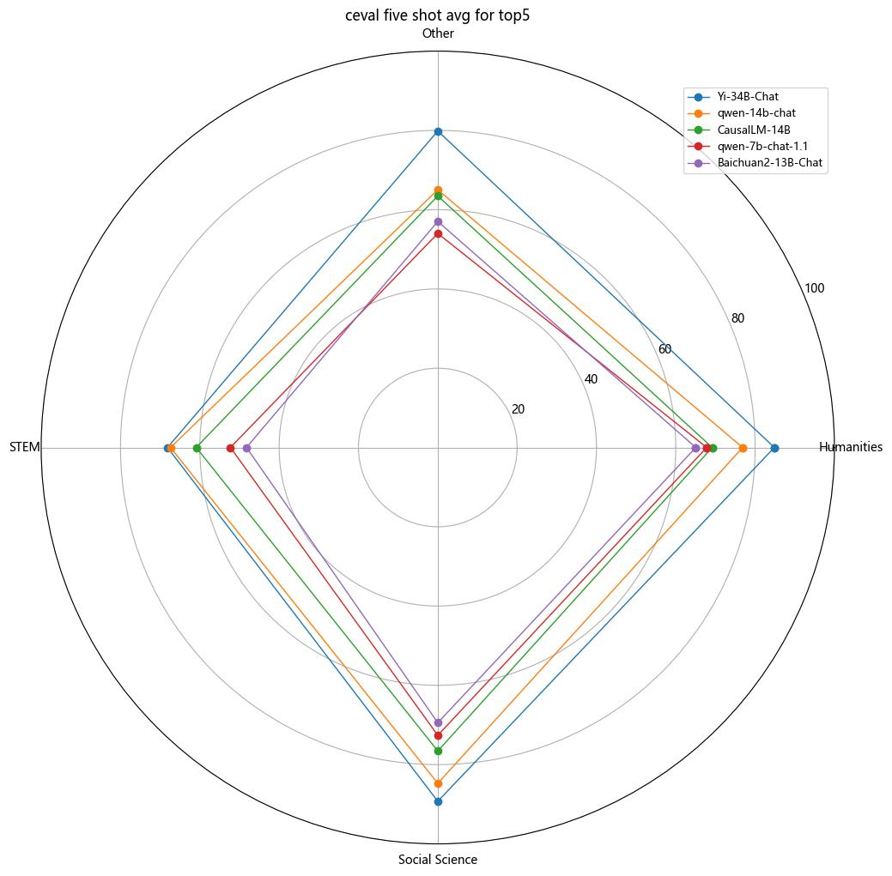
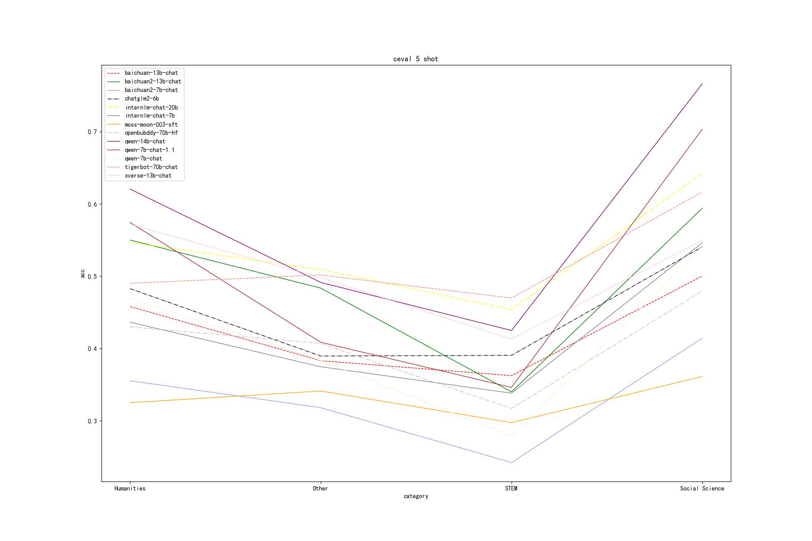
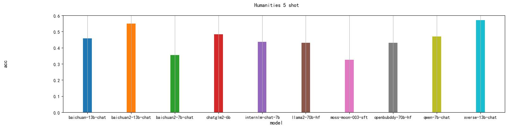
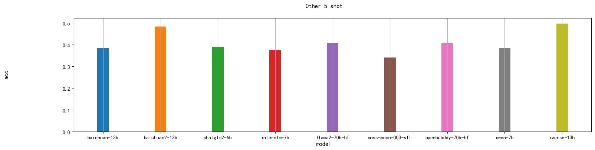
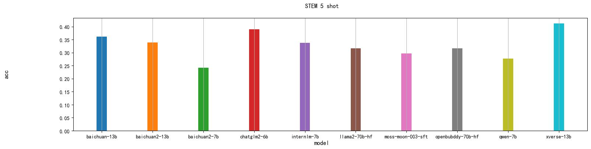
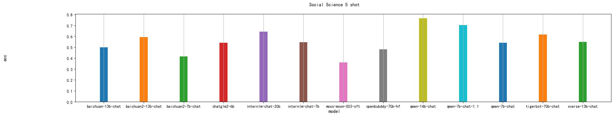

## aigc_evals

 aigc_evals 是在openai/evals基础上修改而来，用于评估基于 aigc_serving 等仿openai 接口开源模型服务的脚本。<br />
部署开源模型移步至[aigc_serving](https://github.com/ssbuild/aigc_serving) 


## 当前支持评估数据集
目前支持 cmmlu , ceval,  mmlu , 翻译数据集 和 结构化抽取 评估


## 安装

```commandline
pip install aigc_evals>=0.0.3

# 源码安装
git clone -b dev https://github.com/ssbuild/aigc_evals.git
pip install -e .
```
## 修改环境变量

```commandline
auto_eval/config.py
设置openai url等参数

或者
export OPENAI_API_KEY="your key"
export OPENAI_API_BASE="http://192.168.2.180:8081/v1"


```

## 修改自定义评估模型

修改 registry/completion_fns/langchain_aigc_serving

```text
langchain/chat_model/chatglm2-6b-int4:
  class: aigc_evals.completion_fns.langchain_llm:LangChainChatModelCompletionFn
  args:
    llm: ChatOpenAI
    chat_model_kwargs:
      model_name: chatglm2-6b-int4
      model_kwargs: # langchain 未明确实现的参数
        adapter_model: default
        top_k: 1
      max_retries: 10
      request_timeout: 200
      top_p: 1.0
      temperature: 1.0
      max_tokens: 2000
```

修改替换 chatglm2-6b-int4 成自己的开放模型，chat_model_kwargs 为 langchain ChatOpenAI 参数


## 一键评估
```commandline
cd auto_eval
python run_ceval.py
```

```commandline
cd auto_eval
python run_cmmlu.py
```

```commandline
wget https://people.eecs.berkeley.edu/~hendrycks/data.tar
下载mmlu数据集
cd auto_eval
python run_mmlu.py
```

```commandline
cd auto_eval
python run_bleu.py
```

```commandline
cd auto_eval
python run_rouge.py
```

```commandline
cd auto_eval
python run_struct.py
```

## ceval 评测结果

|                    | Humanities | Other    | STEM     | Social Science | avg      | update     |
|--------------------|------------|----------|----------|----------------|----------|------------|
| Qwen-72B-Chat      | 0.869848   | 0.835724 | 0.773870 | 0.907048       | 0.846623 | 2023-12-02 |
| Yi-34B-Chat        | 0.848586   | 0.798456 | 0.681462 | 0.892582       | 0.805271 | 2023-11-29 |
| qwen-14b-chat      | 0.768578   | 0.650224 | 0.673924 | 0.847351       | 0.735019 | 2023-11-29 |
| CausalLM-14B       | 0.691717   | 0.634516 | 0.608986 | 0.765770       | 0.675247 | 2023-11-29 |
| qwen-7b-chat-1.1   | 0.678034   | 0.540018 | 0.522806 | 0.726223       | 0.616770 | 2023-11-29 |
| baichuan2-13b-chat | 0.650506   | 0.570232 | 0.482350 | 0.694462       | 0.599387 | 2023-11-29 |
| XVERSE-13B-Chat    | 0.639340   | 0.570026 | 0.456927 | 0.657328       | 0.580905 | 2023-11-29 |
| Qwen-1_8B-Chat     | 0.587182   | 0.526344 | 0.492893 | 0.694892       | 0.575328 | 2023-12-02 |
| baichuan2-7b-chat  | 0.579232   | 0.502889 | 0.478674 | 0.686490       | 0.561821 | 2023-11-29 |
| chatglm3-6b        | 0.584753   | 0.523970 | 0.467902 | 0.663997       | 0.560155 | 2023-11-29 |
| chatglm2-6b        | 0.586350   | 0.492239 | 0.471440 | 0.650574       | 0.550151 | 2023-11-29 |
| internlm-chat-20b  | 0.562072   | 0.488522 | 0.453569 | 0.635189       | 0.534838 | 2023-11-29 |
| tigerbot-70b-chat  | 0.490036   | 0.501515 | 0.469567 | 0.616296       | 0.519353 |            |
| internlm-chat-7b   | 0.479816   | 0.394511 | 0.342306 | 0.606820       | 0.455863 | 2023-11-29 |
| baichuan-13b-chat  | 0.457822   | 0.382894 | 0.362210 | 0.500072       | 0.425749 |            |
| qwen-7b-chat       | 0.469850   | 0.383362 | 0.277942 | 0.540077       | 0.417808 |            |
| openbubddy-70b-hf  | 0.429761   | 0.406713 | 0.316785 | 0.479382       | 0.408160 |            |
| moss-moon-003-sft  | 0.324761   | 0.340964 | 0.297175 | 0.361035       | 0.330984 |            |


                   
                 









## exec_aigc_evals 使用帮助

```text
exec_aigc_evals --help
usage: exec_aigc_evals [-h] [--extra_eval_params EXTRA_EVAL_PARAMS] [--max_samples MAX_SAMPLES] [--cache CACHE]
                       [--visible VISIBLE] [--seed SEED] [--user USER] [--record_path RECORD_PATH]
                       [--log_to_file LOG_TO_FILE] [--registry_path REGISTRY_PATH] [--debug DEBUG]
                       [--local-run LOCAL_RUN] [--http-run HTTP_RUN] [--http-run-url HTTP_RUN_URL]
                       [--http-batch-size HTTP_BATCH_SIZE] [--http-fail-percent-threshold HTTP_FAIL_PERCENT_THRESHOLD]
                       [--dry-run DRY_RUN] [--dry-run-logging DRY_RUN_LOGGING]
                       completion_fn eval

Run evals through the API

positional arguments:
  completion_fn         One or more CompletionFn URLs, separated by commas (,). A CompletionFn can either be the name
                        of a model available in the OpenAI API or a key in the registry (see
                        evals/registry/completion_fns).
  eval                  Name of an eval. See registry.

optional arguments:
  -h, --help            show this help message and exit
  --extra_eval_params EXTRA_EVAL_PARAMS
  --max_samples MAX_SAMPLES
  --cache CACHE
  --visible VISIBLE
  --seed SEED
  --user USER
  --record_path RECORD_PATH
  --log_to_file LOG_TO_FILE
                        Log to a file instead of stdout
  --registry_path REGISTRY_PATH
                        Path to the registry
  --debug DEBUG
  --local-run LOCAL_RUN
                        Enable local mode for running evaluations. In this mode, the evaluation results are stored
                        locally in a JSON file. This mode is enabled by default.
  --http-run HTTP_RUN   Enable HTTP mode for running evaluations. In this mode, the evaluation results are sent to a
                        specified URL rather than being stored locally or in Snowflake. This mode should be used in
                        conjunction with the '--http-run-url' and '--http-batch-size' arguments.
  --http-run-url HTTP_RUN_URL
                        URL to send the evaluation results when in HTTP mode. This option should be used in
                        conjunction with the '--http-run' flag.
  --http-batch-size HTTP_BATCH_SIZE
                        Number of events to send in each HTTP request when in HTTP mode. Default is 1, i.e., send
                        events individually. Set to a larger number to send events in batches. This option should be
                        used in conjunction with the '--http-run' flag.
  --http-fail-percent-threshold HTTP_FAIL_PERCENT_THRESHOLD
                        The acceptable percentage threshold of HTTP requests that can fail. Default is 5, meaning 5%
                        of total HTTP requests can fail without causing any issues. If the failure rate goes beyond
                        this threshold, suitable action should be taken or the process will be deemed as failing, but
                        still stored locally.
  --dry-run DRY_RUN
  --dry-run-logging DRY_RUN_LOGGING

```


## Licenses

[](https://lbesson.mit-license.org/)

本项目遵循 [MIT License](https://lbesson.mit-license.org/).

[](http://creativecommons.org/licenses/by-nc-sa/4.0/)

